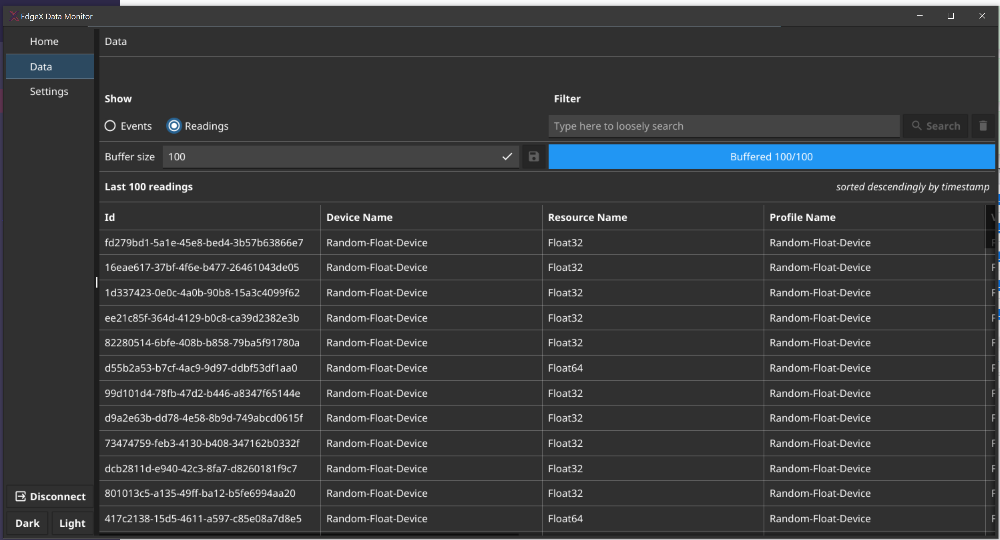
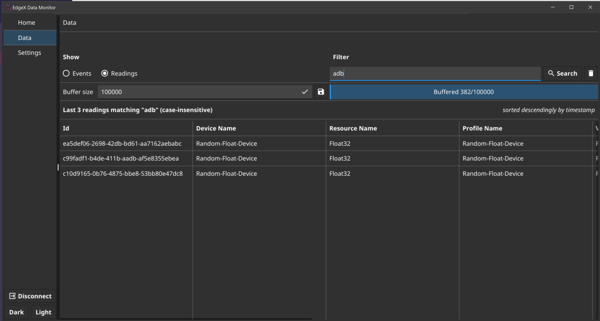

# topcoder-challenge-1a4aa7bf-ff93-41c9-837d-76fb6bf2e2c9
EdgeX Foundry(TM) - Build Simple Data Monitor UI #02

This is the implementation of the challenge https://www.topcoder.com/challenges/1a4aa7bf-ff93-41c9-837d-76fb6bf2e2c9 for which I classified 1st.

TLDR; left is Linux, right is Windows


## Connected state


## Data page
The data page allows the user to view Events


and Readings


as they are ingested.

### Buffer size
It has a configurable "Buffer size" that indicates the number of events/readings that are gonna be kept in memory for further inspection. When the buffer is full, the oldest event/reading is dropped.
The initial value can be changed in the Settings page:


### Filter
The filter effectively starts a "live query" on the data.
It means that it will match events/readings matching in a case-insensitive way their properties with the filter.
The query is run on the buffer and it means that the results will change as the events/readings are dropped/received.


If the user is viewing readings, the query will match also the parent event properties as per requirements


Clicking on an event/reading allows the user to inspect the JSON.


## IMPORTANT ZeroMq deprecation!

I had to patch the referenced  https://github.com/edgexfoundry/go-mod-messaging library because it uses a library that made me lose a whole day while trying to make it work in my environment. It will be soon deprecated as stated here https://github.com/edgexfoundry/go-mod-messaging/issues/73

Also, we use Redis, not zeromq so it’s totally fine

Currently my patched version is referenced with a go mod replace entry


## IMPORTANT Darwin compilation

❗❗❗❗ 🍎
>OSX/Darwin/Apple cross-compiling requires a darwin host and/or some manual steps along with the acceptance of Xcode license terms
Please follow the link below:
https://github.com/fyne-io/fyne-cross#build-the-docker-image-for-osxdarwinapple-cross-compiling

❗❗❗❗


## WSL2 GUI

In order to run the Linux version on WSL you need an X11 server like **VcXsrv** launched with the following settings:


And then run the following command, at least this is what I had to do on my machine 😉

```bash
export DISPLAY=$(cat /etc/resolv.conf | grep nameserver | awk '{print $2; exit;}'):0.0
export LIBGL_ALWAYS_INDIRECT=0
```


## docker-compose

The docker compose includes the UI which is accessible here:

http://localhost:4000/#/dashboard

you can try to increase/decrease the amount of events being produced by changing the settings in here: http://localhost:4000/#/metadata/device-center/device-list


Or going directly into one of the devices' settings:
http://localhost:4000/#/metadata/device-center/edit-device?deviceName=Random-Float-Device


### License

Apache License Version 2.0
